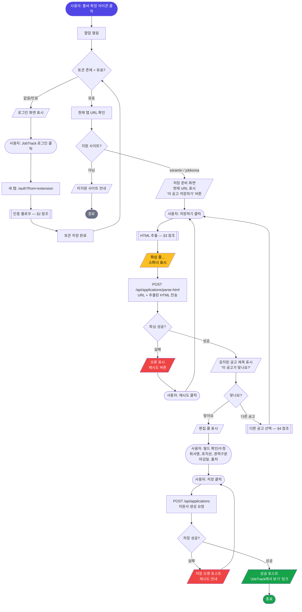
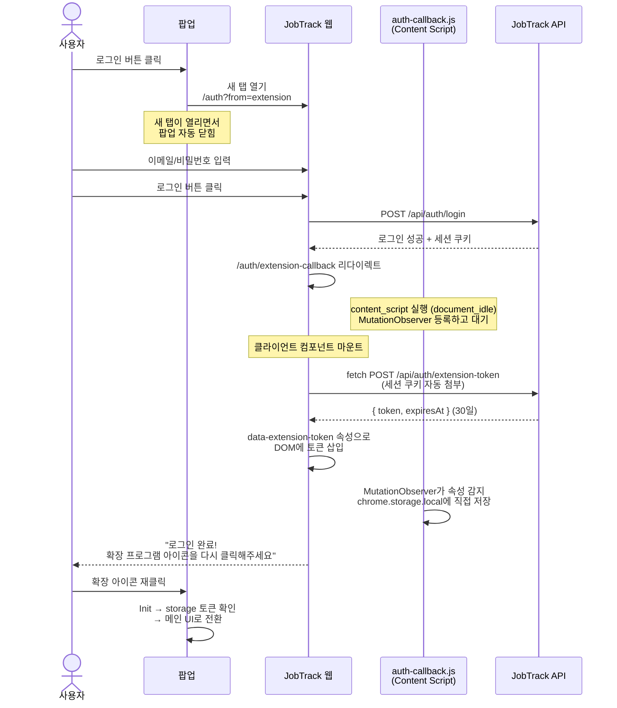
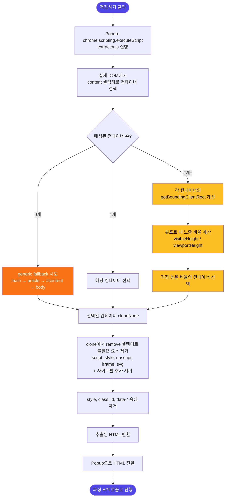
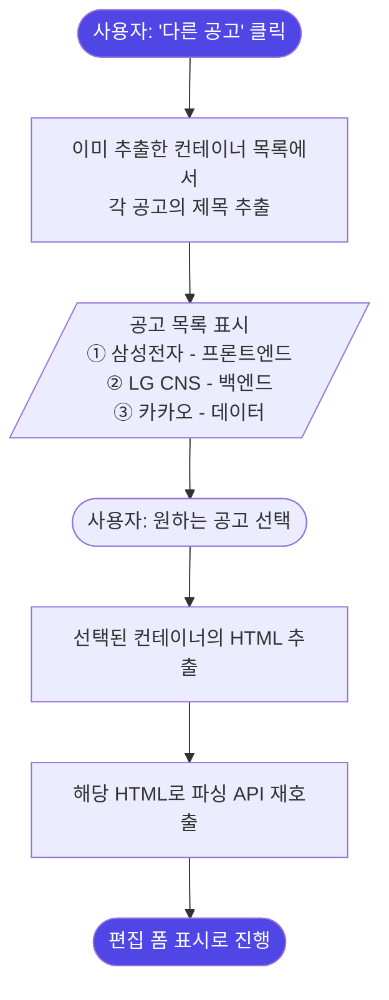
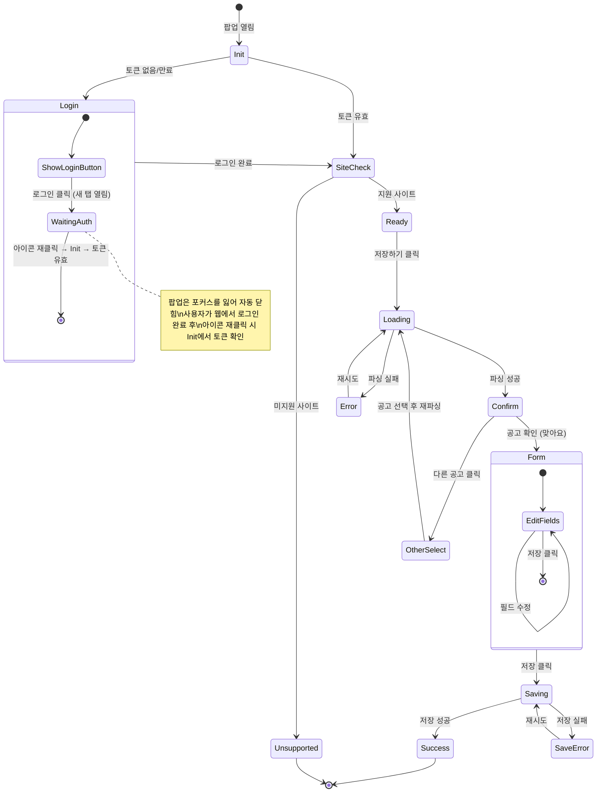
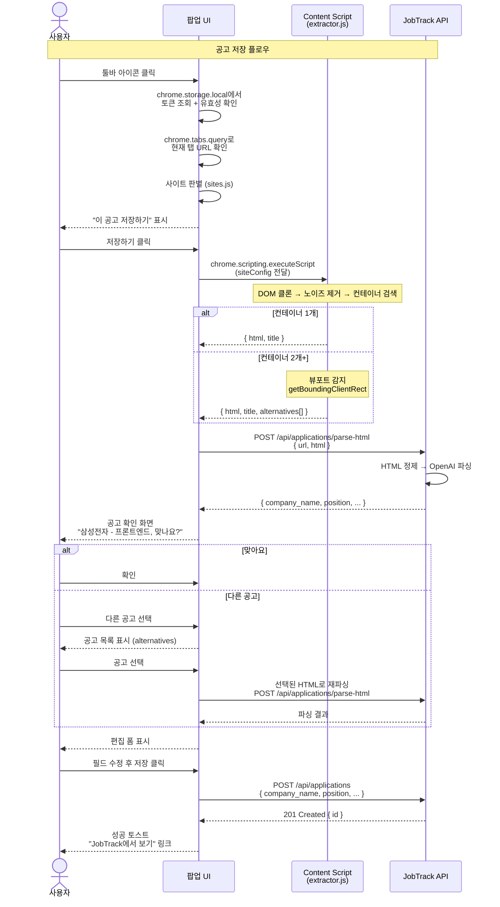

# JobTrack 크롬 확장 프로그램 — 사용자 플로우

> **문서 역할**: 확장 프로그램의 전체 사용자 플로우를 Mermaid 다이어그램으로 정의한다.
> **요구사항**: `docs/extension/requirements.md` 참조

---

## 1. 전체 플로우 (메인)

확장 프로그램 아이콘 클릭부터 공고 저장 완료까지의 전체 흐름.

---

## 2. 인증 플로우 (서브)

팝업 → JobTrack 웹 로그인 → 토큰 전달까지의 상세 흐름.

---

## 3. HTML 추출 플로우 (서브) — 뷰포트 감지

페이지에서 "사용자가 보고 있는 공고"를 자동 판별하여 HTML을 추출하는 흐름.

> 구현 메모: 뷰포트 계산은 실제 페이지 DOM에서 수행한다. `cloneNode(true)`로 분리된 DOM은 레이아웃 정보가 없어 `getBoundingClientRect()`가 유효하지 않을 수 있으므로, 후보 선택 후 선택된 컨테이너와 alternatives만 clone하여 노이즈/속성을 제거한다.

---

## 4. 다른 공고 선택 플로우 (서브)

뷰포트 감지 결과가 틀렸을 때, 사용자가 수동으로 공고를 선택하는 흐름.

---

## 5. 팝업 UI 상태 전이

팝업이 가질 수 있는 모든 상태와 전이를 정의한다.

---

## 6. 컴포넌트 간 통신 흐름

팝업, Content Script, 서버 간의 메시지 흐름 전체를 시간순으로 정리.

