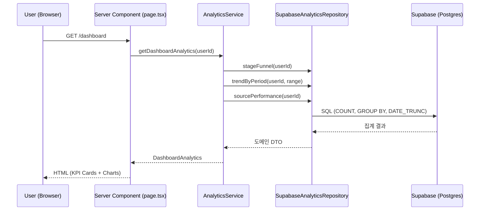
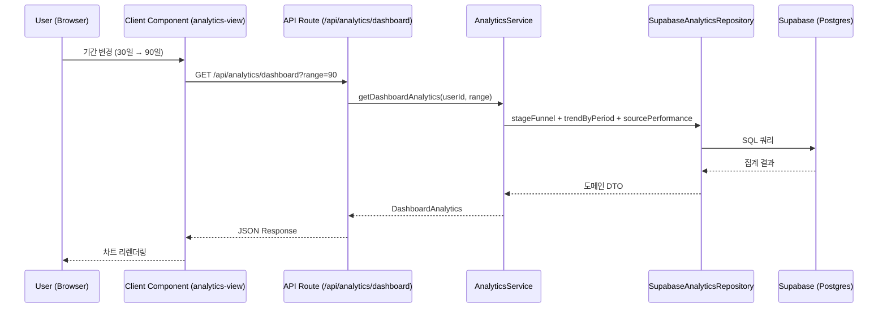

# 데이터 시각화 및 분석 기능 가이드

## 1. 개요
취업 지원 데이터를 시각화하여 **행동 가능한 인사이트**를 제공한다. 단순 숫자 나열이 아닌, 합격률(서류→면접 전환율)을 북극성 지표로, 꾸준함(일별 활동 추이)을 선행 지표로 설정하여 사용자의 취업 전략 개선을 유도한다.

**핵심 원칙**: "시각화만 있고 행동 유도가 없는 '관상용' 지표 추가 금지"

## 2. 사용자 여정 (User Journey)

### 2.1 Dashboard — 전체 현황 파악
1. 사용자가 `/dashboard`에 진입한다.
2. 상단 KPI 5카드(총 지원, 진행중, 합격률, 주간 활동, 평균 소요일)로 핵심 숫자를 확인한다.
3. 퍼널 차트에서 각 단계별 전환율을 보고 병목 구간을 식별한다.
4. 추이 차트에서 최근 활동 패턴을 확인하고 꾸준함을 점검한다.
5. 출처별 성과 차트에서 어떤 채널이 효과적인지 파악한다.

### 2.2 Board — 운영 지표 확인
1. 칸반 보드 칼럼 헤더에서 전환율(→ N%)을 확인한다.
2. 14일 이상 정체된 지원서에 amber 배지가 표시되어 후속 조치를 유도한다.

### 2.3 Application Detail — 개별 타임라인
1. 지원서 상세 페이지에서 타임라인 카드를 확인한다.
2. 각 이벤트의 D-day 배지와 상대 시간으로 진행 속도를 파악한다.

### 2.4 Analytics — 심화 분석
1. `/analytics` 페이지에서 기간 범위를 선택한다 (7일/30일/90일/전체).
2. 기간에 맞춘 전체 차트(퍼널, 추이, 출처별 성과)를 심층 분석한다.

## 3. 시스템 흐름 (System Flow)

### 3.1 Dashboard/Board — Server Component 직접 조회



### 3.2 Analytics 심화 — Client Component + API Route



## 4. 레이어별 역할 및 책임

- **Controller (Server Component / API Route)**:
  - 인증 검증 (`requireServerAuth` / `requireAuth`)
  - 입력 유효성 검사 (Zod: `analyticsQuerySchema`)
  - `createAnalyticsContainer()`로 DI 조립
  - analytics 실패 시 기존 UI 유지 (try/catch fallback)

- **Service (`AnalyticsService`)**:
  - 3개 유스케이스 메서드: `getDashboardAnalytics`, `getBoardAnalytics`, `getApplicationTimeline`
  - Repository 메서드 조합 및 DTO 구성
  - 비즈니스 규칙 없음 (순수 집계 조합) — 향후 캐싱/비교 로직 확장점

- **Repository (`IAnalyticsRepository` / `SupabaseAnalyticsRepository`)**:
  - 6개 집계 메서드: `stageFunnel`, `trendByPeriod`, `sourcePerformance`, `boardMetrics`, `dailyActivity`, `timelineForApplication`
  - Supabase SDK를 통한 SQL 집계 쿼리 실행
  - 소유권 필터(`user_id`) 강제

- **Chart Layer (`components/charts/` + 각 페이지 `_components/`)**:
  - `ChartCard`: 공통 래퍼 (타이틀, 빈 상태, 반응형 컨테이너)
  - `CHART_COLORS`: CSS 변수 기반 색상 시스템 (라이트/다크 자동 전환)
  - 각 차트 컴포넌트: `"use client"`, Server Component에서 props로 데이터 수신

## 5. 학습 포인트 (Learning Points)

### 💡 북극성 지표 설계
- **Problem**: 어떤 데이터를 시각화할지 기준이 없으면 '관상용' 지표가 늘어난다.
- **Solution**: 합격률(서류→면접 전환율)을 북극성 지표로 선정하고, "이 지표를 보고 사용자가 어떤 행동을 바꿀 수 있는가?"라는 질문으로 모든 지표를 필터링했다.
- **Insight**: 지표 선정 시 "행동 유도 가능성"이 핵심 기준이며, 이 기준이 없으면 대시보드가 복잡해질수록 가치가 떨어진다.

### 💡 Server/Client Component 분리 전략
- **Problem**: 차트는 Client Component가 필수이지만, 데이터 페칭을 클라이언트에서 하면 waterfall이 발생한다.
- **Solution**: Server Component에서 데이터를 페칭하고 차트 Client Component에 props로 전달. `/analytics` 페이지만 기간 전환이 필요하므로 Client Component에서 API 호출.
- **Insight**: "인터랙티브한 부분만 Client Component로 분리"하면 Server Components의 성능 이점을 최대한 활용할 수 있다.

```typescript
// Dashboard page.tsx (Server Component) — 데이터 페칭
const { analyticsService } = createAnalyticsContainer();
const analytics = await analyticsService.getDashboardAnalytics(userId);

// 차트에 props 전달 (Client Component)
<DashboardFunnelChart data={analytics.stageFunnel} />
```

### 💡 Graceful Degradation
- **Problem**: analytics 서비스 장애 시 기존 Dashboard가 깨질 수 있다.
- **Solution**: analytics 조회를 try/catch로 감싸고, 실패 시 기존 3카드(총 지원/진행중/다가오는 일정)로 fallback. 차트 영역은 렌더링하지 않음.
- **Insight**: 부가 기능의 장애가 핵심 기능의 가용성을 해치지 않도록 "독립 실패" 원칙을 적용하는 것이 중요하다.
