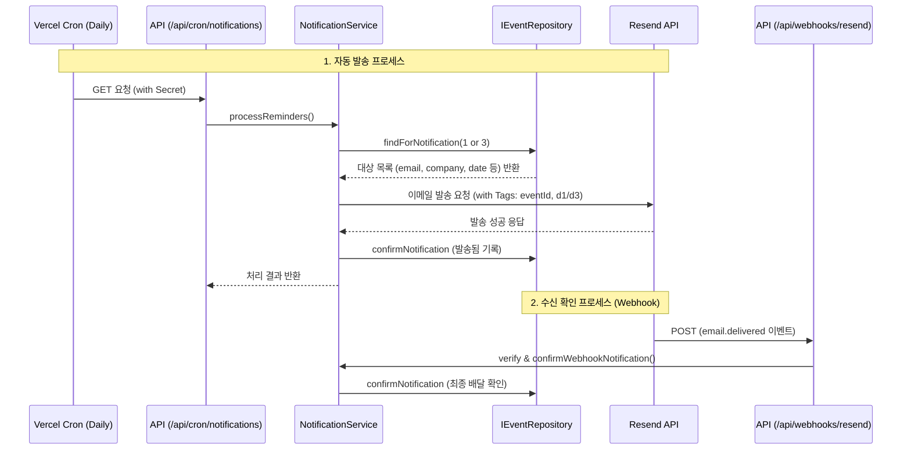

# 알림 시스템 (Notification System Flow)

## 1. 개요
취업 지원 일정(면접, 코테 등) 마감 전 사용자가 잊지 않도록 **D-3, D-1 리마인더 이메일**을 자동으로 발송하는 시스템입니다. Vercel Cron, Resend API, 그리고 Webhook을 연계하여 신뢰성 있는 알림을 제공합니다.

## 2. 시스템 아키텍처 및 흐름 (Sequence Diagram)

## 3. 계층별 역할 및 책임

### [Controller] API Routes
- **`/api/cron/notifications`**: Vercel Cron 전용 엔드포인트. `CRON_SECRET`을 통한 인증 후 `NotificationService`를 호출합니다.
- **`/api/webhooks/resend`**: Resend로부터 배달 완료 이벤트를 수신합니다. `svix`를 통해 서명을 검증하여 보안을 확보합니다.

### [Service] NotificationService & EmailService
- **`NotificationService`**: 알림 대상 조회, 메일 템플릿(HTML) 구성, 발송 후 상태 업데이트 등 전체 비즈니스 로직을 관장합니다.
- **`EmailService`**: Resend SDK를 래핑하여 실제 메일 발송 및 웹훅 서명 검증을 담당합니다.

### [Infrastructure] Repository
- **`IEventRepository`**: 
    - `findForNotification(days)`: `scheduled_at` 기준 오늘로부터 N일 전인 일정을 조회합니다.
    - `confirmNotification(eventId, type)`: 특정 이벤트의 알림 발송 여부 플래그(`notified_d1`, `notified_d3`)를 업데이트합니다.

## 4. 학습 포인트 (Learning Points)

### 💡 에러 핸들링: `Promise.allSettled` 활용
- **Problem**: 대량의 메일을 루프를 돌며 `await`로 보낼 경우, 중간에 하나만 실패해도 나머지 메일이 발송되지 않는 문제가 발생했습니다.
- **Solution**: 모든 발송 Promise를 배열로 담아 `Promise.allSettled`를 사용했습니다.
- **Insight**: 배치 작업에서는 개별 작업의 실패가 전체 프로세스를 중단시키지 않도록 설계하는 것이 중요하며, 각 결과의 `status`를 체크하여 성공/실패 지표를 별도로 관리해야 함을 배웠습니다.

### 💡 보안: Webhook 서명 검증
- **Problem**: 외부 웹훅 엔드포인트는 누구나 호출할 수 있으므로, 악의적인 공격자가 가짜 이메일 배달 완료 신호를 보낼 수 있습니다.
- **Solution**: `svix` 라이브러리를 사용해 Resend에서 보낸 헤더의 서명을 검증하는 로직을 추가했습니다.
- **Insight**: 인프라 간 연동 시에는 반드시 신뢰할 수 있는 통신인지 확인하는 계층이 필요합니다.

### 💡 데이터 추적: Resend Tags 사용
- **Problem**: 웹훅이 왔을 때, 이 메일이 어떤 지원서의 어떤 일정(`eventId`)에 대한 것인지 알기 어렵습니다.
- **Solution**: 메일 발송 시 `tags` 필드에 `eventId`와 `notificationType`을 담아 보냈습니다.
- **Insight**: 외부 서비스와 비동기로 통신할 때, 메타데이터를 태그나 커스텀 필드로 전달하면 콜백 시점에 컨텍스트를 복구하는 데 매우 유용합니다.
