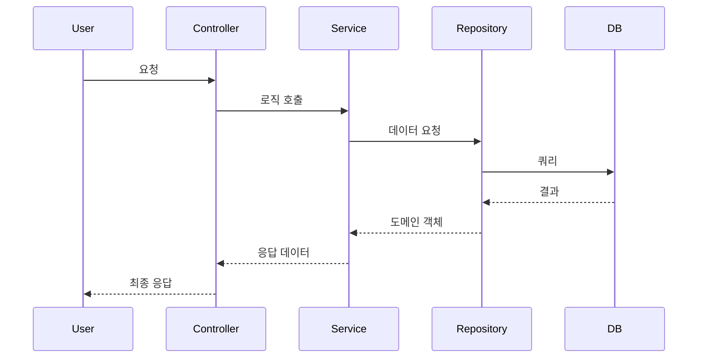

# [Feature Name] 기능 가이드

## 1. 개요
이 기능이 해결하고자 하는 문제와 핵심 가치를 간략히 기술합니다.

## 2. 사용자 여정 (User Journey)
사용자가 이 기능을 어떻게 사용하는지 단계별로 설명합니다.

## 3. 시스템 흐름 (System Flow)
데이터가 각 레이어를 어떻게 통과하는지 Mermaid 다이어그램을 활용해 시각화합니다.



## 4. 레이어별 역할 및 책임
각 계층에서 이 기능을 위해 어떤 일을 수행하는지 구체적으로 기술합니다.
- **Controller**:
- **Service**:
- **Repository**:

## 5. 학습 포인트 (Learning Points)
구현 과정에서 배운 기술적 지식이나 인사이트를 기록합니다. (Problem-Solution-Insight 프레임워크 권장)

### 💡 [Topic]
- **Problem**: 
- **Solution**: 
- **Insight**: 
```typescript
// 핵심 코드 스니펫
```
